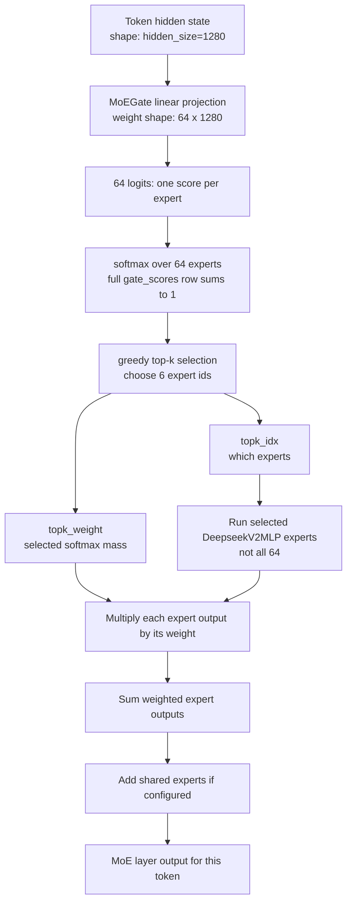
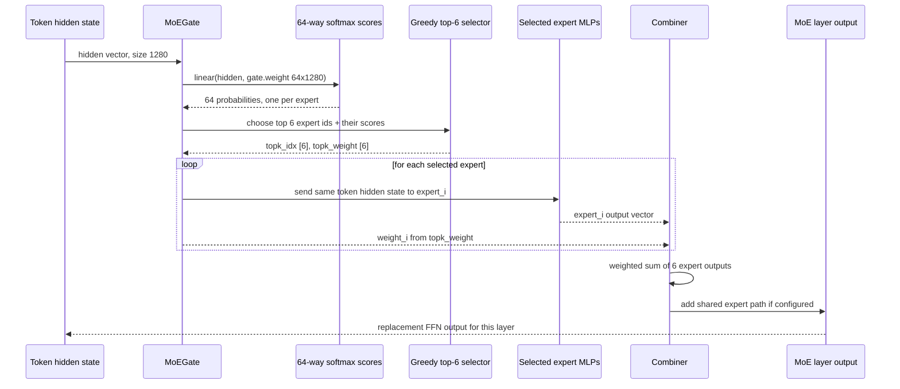
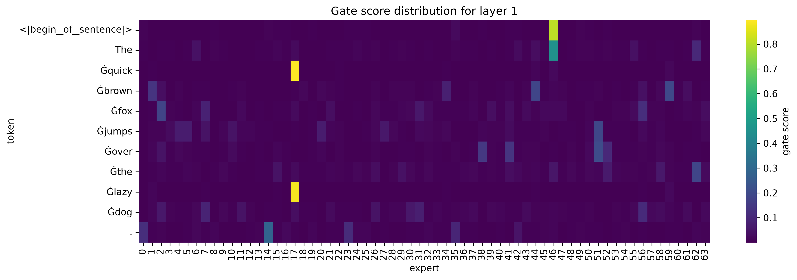
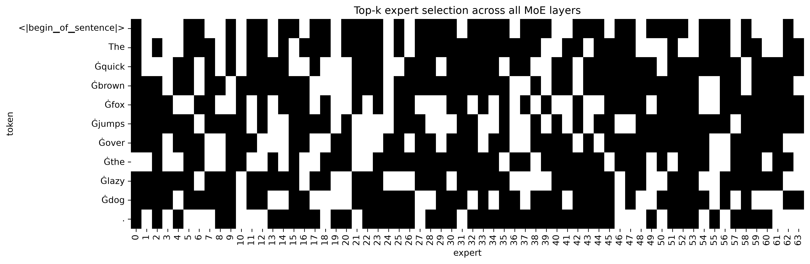
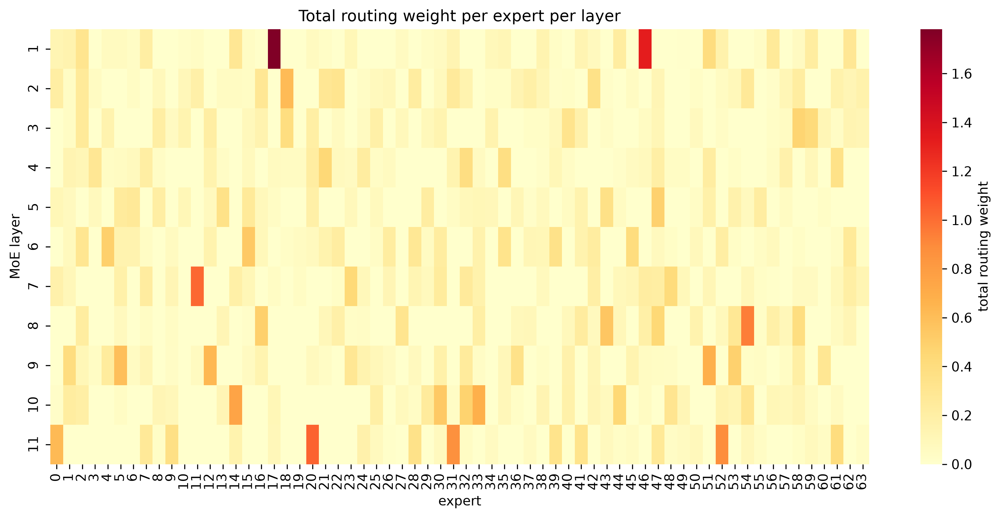
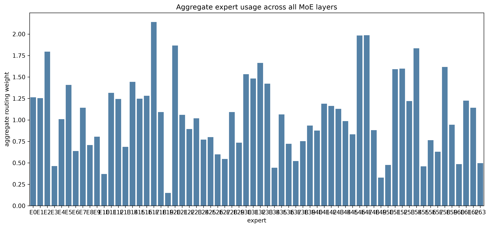

# 001 — How Unlimited-OCR routes tokens through its Mixture-of-Experts decoder

Notebook: `notebooks/000-unlimited-ocr-demo/notebooks-py/001-moe-inspection.py`
Artifacts: `outputs/2026-07-26/000-unlimited-ocr-demo/001-moe-inspection/`

## The question

Unlimited-OCR's text decoder is a 12-layer DeepSeek-V2-style transformer. Eleven of those layers are
Mixture-of-Experts (MoE): instead of one shared feed-forward network, each MoE layer holds 64 small
expert FFNs, and a lightweight gate picks a handful of them per token. That raises a concrete
learning question:

**When a real sentence passes through the decoder, which experts does each token actually visit, how
confident is the gate, and is the work spread evenly across the 64 experts — or does a small clique
do everything?**

Answering this matters because "64 experts, top-6 routing" is only a config-line claim until you
watch a forward pass. This report walks through what was measured, what the measurements show, and
what to take away.

## The instrumentation

The notebook runs one real forward pass of `baidu/Unlimited-OCR` (bfloat16) on the sentence:

```text
The quick brown fox jumps over the lazy dog.
```

That tokenizes to 11 tokens ([`00_input_tokens.json`](../outputs/2026-07-26/000-unlimited-ocr-demo/001-moe-inspection/intermediate/00_input_tokens.json)):

```text
<｜begin▁of▁sentence｜>  The  Ġquick  Ġbrown  Ġfox  Ġjumps  Ġover  Ġthe  Ġlazy  Ġdog  .
```

Three probes are attached before the pass:

1. **Forward hooks on every MoE gate.** Each MoE layer's `gate` module returns `(topk_idx,
   topk_weight, aux_loss)`. A hook records those tensors unchanged, so we see exactly what the
   router decided at every layer.
2. **A pre-hook on layer 1's gate.** It captures the hidden state entering the gate (shape `[1, 11,
   1280]`), from which the full softmax score distribution over all 64 experts is recomputed — the
   gate's "opinion" *before* top-k truncation.
3. **Aggregation.** Per-layer expert loads (summed routing weights) and a model-wide usage histogram
   are computed from the captured tensors.

Architecture facts confirmed from the loaded model (not assumed): 12 layers, layer 0 is dense
(`DeepseekV2MLP`), layers 1–11 are MoE (`DeepseekV2MoE`), 64 routed experts, 6 experts per token,
`topk_method: greedy`, hidden size 1280, gate weight shape `[64, 1280]`.

Big picture first: **there is not one MoE router in the whole model. There are 11 MoE layers.**
Each token is routed again at each MoE layer, so the same token can choose different experts as it
moves upward through the decoder.

```text
TRANSFORMER DECODER = stack of layers

input tokens
   |
   v
+---------+
| layer 0 |  attention + normal dense FFN
+---------+
   |
   v
+---------+
| layer 1 |  attention + MoE FFN  <-- first MoE router inspected in detail
+---------+
   |
   v
+---------+
| layer 2 |  attention + MoE FFN  <-- token is routed again here
+---------+
   |
   v
   ...
   |
   v
+----------+
| layer 11 | attention + MoE FFN  <-- routed again here too
+----------+
   |
   v
output logits / next token
```

Inside each MoE FFN block:

```text
token vector
   |
   v
+------+
| gate |  scores 64 routed experts
+------+
   |
   v
pick top 6 experts
   |
   +-------> Expert A ---- output * weight_A ----+
   |                                             |
   +-------> Expert B ---- output * weight_B ----+
   |                                             |
   +-------> Expert C ---- output * weight_C ----+--> sum --> routed output
   |                                             |
   +-------> Expert D ---- output * weight_D ----+
   |                                             |
   +-------> Expert E ---- output * weight_E ----+
   |                                             |
   +-------> Expert F ---- output * weight_F ----+

shared expert path ------------------------------------------+
                                                             |
routed output -----------------------------------------------+--> final MoE FFN output
```

Read this as: layer 1 routing is only first MoE decision. Layer 2, 3, …, 11 do their own routing
again from the token representation they receive.

## MoE refresher, question-answer style

**Q: Is this router like LiteLLM routing a request to one model?**  
No. LiteLLM routes one whole request to one model endpoint. MoE routes one token, inside one layer,
to a few small FFN subnetworks.

**Analogy:** LiteLLM router = choose one restaurant for dinner. MoE router = one kitchen station
chooses six cooks to work on one ingredient, blends their work, then sends it to the next station.

**Q: Where does DeepSeek fit?**  
Unlimited-OCR inherits a DeepSeek-style MoE decoder. DeepSeek-V2 reports 160 routed experts + 2
shared experts, with 6 routed experts active per token. This Unlimited-OCR checkpoint is smaller:
actual loaded config/run.log show 64 routed experts, top-6 per token, plus 2 shared experts.

**Q: What is an “expert”?**  
An expert is a `DeepseekV2MLP` feed-forward block. It is not a full LLM. It is not an API endpoint.
It is one FFN subnetwork inside a transformer layer.

**Q: What does the gate look like?**  
In code, `MoEGate.weight` has shape `[64, 1280]`. For each token hidden vector of size 1280, the
gate computes 64 scores — one score per routed expert.

**Q: Why softmax over 64?**  
Because the gate is asking: “for this token at this layer, how much does each of the 64 experts
seem useful?” The full 64-way softmax is `gate_scores`.

**Q: Does it choose one expert?**  
No. It selects top-6 experts. Then it runs all 6 selected expert MLPs and computes a weighted sum of
their outputs.

**Q: What is the formula saying?**  
For one token, the MoE FFN output is:

$$
\text{output} = \text{shared expert output} + \text{weighted mix of selected routed expert outputs}
$$

More explicitly:

$$
\text{output} = \text{shared}(\text{token}) + \sum_{i \in \text{top-6 experts}} \text{weight}_i \cdot \text{expert}_i(\text{token})
$$

Term translation:

- `token`: current token representation entering this MoE layer.
- `expert_i(token)`: output of expert `i` after processing that token.
- `weight_i`: router weight for expert `i`.
- `top-6 experts`: only these six routed experts run.
- `shared(token)`: always-on shared expert path, added for every token.

So the model does not pick one expert. It makes a weighted blend of six routed expert outputs, plus the shared path.

**Q: What should I remember before reading plots?**  
Evidence 3 shows the full 64-way softmax. Evidence 4 throws away weights and only shows “was this
expert selected at least once?” Evidence 2 keeps both expert ids and weights.

Actual code path in Unlimited-OCR's cached `modeling_deepseekv2.py`:



Read that flowchart left to right as data transformation. The token is not leaving the model; it is
being transformed by several FFN subnetworks inside the current transformer layer.

---

Same thing as a sequence for **one token in one MoE layer**:

Algorithm in plain English:

1. **Score experts**
   - Token vector enters the MoE layer.
   - Gate scores all 64 routed experts.
   - Softmax turns raw scores into gate scores.

2. **Select experts**
   - Gate picks top 6 experts.
   - Other 58 routed experts are ignored for this token in this layer.

3. **Run selected experts**
   - Same token vector is sent to those 6 experts.
   - Each selected expert returns an output vector.

4. **Blend outputs**
   - Each expert output is multiplied by its gate weight.
   - Weighted expert outputs are summed.

5. **Finish layer FFN output**
   - Shared expert path is added.
   - Final MoE output goes to the next transformer layer.

Tiny concrete example from layer 1:

```text
token = "Ġquick"

selected experts:
E17 = 0.8965
E46 = 0.0192
E59 = 0.0145
E44 = 0.0108
E22 = 0.0061
E34 = 0.0061

final = shared("Ġquick")
      + 0.8965 * E17("Ġquick")
      + 0.0192 * E46("Ġquick")
      + 0.0145 * E59("Ġquick")
      + 0.0108 * E44("Ġquick")
      + 0.0061 * E22("Ġquick")
      + 0.0061 * E34("Ġquick")
```

Core idea: dense FFN uses the same FFN for every token; MoE FFN builds a custom weighted blend of a few experts for each token.



Example row, layer 1:

```text
Ġquick -> experts [17, 22, 44, 46, 59, 34]
weights [0.8965, 0.0061, 0.0108, 0.0192, 0.0145, 0.0061]
```

Read it as: run those six experts on `Ġquick`, multiply each output by its weight, then sum. Expert
17 dominates, but the model still selected six experts.

## Evidence 1 — routing is real, and the shapes prove it

Every MoE layer recorded routing tensors of shape `[11, 6]` ([`01_routing_shapes_all_layers.json`](../outputs/2026-07-26/000-unlimited-ocr-demo/001-moe-inspection/intermediate/01_routing_shapes_all_layers.json)):
11 tokens, 6 selected experts each, with 6 weights per token. `aux_loss` is `null` at inference —
load-balancing loss only exists during training.

This is the ground truth for everything below: **top-6 routing over 64 experts is active in every
MoE layer of this model.**

## Evidence 2 — top-6 does not mean six-way sharing

The layer-1 routing table [`01_routing_table_layer1.csv`](../outputs/2026-07-26/000-unlimited-ocr-demo/001-moe-inspection/intermediate/01_routing_table_layer1.csv) shows the expert set and weight each token received:

| token | selected experts | weights |
|---|---|---|
| `<｜begin▁of▁sentence｜>` | `[0, 35, 46, 49, 62, 14]` | `[0.0097, 0.0213, 0.8058, 0.009, 0.0074, 0.0074]` |
| `The` | `[6, 44, 46, 55, 62, 42]` | `[0.041, 0.0304, 0.4505, 0.0379, 0.0988, 0.0253]` |
| `Ġquick` | `[17, 22, 44, 46, 59, 34]` | `[0.8965, 0.0061, 0.0108, 0.0192, 0.0145, 0.0061]` |
| `Ġbrown` | `[1, 34, 44, 56, 59, 2]` | `[0.1361, 0.0789, 0.1838, 0.0366, 0.1955, 0.0329]` |
| `Ġjumps` | `[4, 5, 20, 27, 51, 7]` | `[0.0674, 0.0683, 0.0671, 0.0592, 0.1906, 0.0451]` |
| `Ġlazy` | `[1, 17, 34, 56, 59, 44]` | `[0.0109, 0.886, 0.007, 0.0049, 0.0194, 0.0041]` |
| `.` | `[0, 14, 23, 35, 42, 16]` | `[0.1184, 0.2846, 0.1093, 0.0943, 0.0457, 0.0204]` |

Two routing personalities sit side by side:

- **Sharp routing.** `Ġquick` puts 0.8965 on expert 17 alone; `Ġlazy` puts 0.886 on expert 17; the
  BOS token puts 0.8058 on expert 46. The other five selected experts receive crumbs (~0.005–0.02).
  Functionally these tokens are close to top-1 routing — the extra five experts contribute a small
  residual blend.
- **Spread routing.** `Ġjumps` splits weight across five experts in the 0.045–0.19 band; `Ġover`'s
  top expert takes only 0.2066. No single expert is a clear winner.

**Learning:** top-k is a *budget*, not a partition. The gate is free to concentrate the entire
budget on one expert or spread it across all six, and it does both within one sentence. The
six-weight vector is where the real routing decision lives — the index list alone would hide it.

## Evidence 3 — gate scores before truncation



This heatmap is the full softmax over all 64 experts for each token at layer 1 — the distribution
*before* top-6 selection. **How to read it:** each row sums to 1. A row with one bright cell and 63
dark cells is a confident, sharp route; a row that glows faintly across many columns is undecided.
Compare row `Ġquick` (one bright cell at E17, score 0.8965) against row `Ġover` (several
mid-brightness cells, top score only 0.2066).

Top-5 scores per token ([`02_gate_scores_top5.csv`](../outputs/2026-07-26/000-unlimited-ocr-demo/001-moe-inspection/intermediate/02_gate_scores_top5.csv)):

| token position | top experts | top scores |
|---:|---|---|
| 0 (BOS) | `[46, 35, 0, 49, 62]` | `[0.8058, 0.0213, 0.0097, 0.009, 0.0074]` |
| 2 (`Ġquick`) | `[17, 46, 59, 44, 22]` | `[0.8965, 0.0192, 0.0145, 0.0108, 0.0061]` |
| 6 (`Ġover`) | `[51, 38, 41, 52, 2]` | `[0.2066, 0.1457, 0.1358, 0.1003, 0.0454]` |
| 8 (`Ġlazy`) | `[17, 59, 1, 34, 56]` | `[0.886, 0.0194, 0.0109, 0.007, 0.0049]` |

Note the gap structure, not just the winners. For `Ġquick` there is a ~45× drop from rank 1 to rank
2 — the gate is certain. For `Ġover` the top three scores are within 1.5× of each other — the gate
is genuinely torn, and top-6 truncation is binding: experts ranked 7+ still carry meaningful mass
but are cut.

**Learning:** the hidden state entering the gate (saved in
[`02_hidden_state_summary.json`](../outputs/2026-07-26/000-unlimited-ocr-demo/001-moe-inspection/intermediate/02_hidden_state_summary.json),
mean ≈ 0.005, std ≈ 0.55, range −4.6 to 8.9) is projected through a single `[64, 1280]` weight
matrix. Sharp vs. spread routing is entirely a property of how that projection lands per token —
same gate, wildly different confidence.

## Evidence 4 — which experts each token visits, across all layers



Binary matrix: rows are tokens, columns are the 64 experts, a dark cell means "this token selected
this expert in at least one of the 11 MoE layers." **How to read it:** tall dark columns are popular
experts used by many tokens; empty columns are experts this sentence never touched anywhere. Rows
show how wide each token's itinerary is — with 11 layers × 6 picks = 66 selections per token, a
token that keeps revisiting the same experts leaves a sparse row, while one that roams fills in many
columns.

**Learning:** tokens do not have one fixed "home" expert. Routing is recomputed per layer from that
layer's hidden state, so a token's expert set changes as it moves up the stack — layer 1 sends
`Ġquick` mostly to E17, but by layer 7 the same token's mass has shifted to E11 (0.5157), and layer
10 splits it between E14 and E44. Expert choice is a *per-layer* decision, not a per-token
assignment.

## Evidence 5 — per-layer expert load



Rows are the 11 MoE layers, columns are the 64 experts, brightness is total routing weight received from all 11 tokens in that layer (source: [`04_expert_load.csv`](../outputs/2026-07-26/000-unlimited-ocr-demo/001-moe-inspection/intermediate/04_expert_load.csv)).
**How to read it:** a bright cell is a hotspot — one expert soaking up most of a layer's tokens.
Scan row by row: which column wins, and how much brighter is it than the rest of the row?

Dominant expert per layer:

| layer | dominant expert | load |
|---|---|---:|
| layer_1 | E17 | 1.7825 |
| layer_2 | E18 | 0.6173 |
| layer_3 | E58 | 0.4705 |
| layer_4 | E21 | 0.4445 |
| layer_5 | E47 | 0.4932 |
| layer_6 | E15 | 0.5428 |
| layer_7 | E11 | 1.0222 |
| layer_8 | E54 | 0.9426 |
| layer_9 | E51 | 0.6775 |
| layer_10 | E14 | 0.7543 |
| layer_11 | E20 | 1.0433 |

**Learning:** every layer has a different favorite expert — no expert dominates the whole model, and
no layer lacks a hotspot. Layer 1 is the most concentrated (E17 carries 1.78 of the layer's total
weight, driven by the sharp `Ġquick`/`Ġlazy` routes), while middle layers like 3–5 are comparatively
flat (top expert under 0.5). Concentration is a per-layer property, so expert-parallel deployment or
capacity planning has to reason per layer, not globally.

## Evidence 6 — aggregate usage across the whole pass



One bar per expert: selected `topk_weight` summed over all layers and tokens (source: [`05_aggregate_usage.csv`](../outputs/2026-07-26/000-unlimited-ocr-demo/001-moe-inspection/intermediate/05_aggregate_usage.csv)).
Across this run, selected top-6 routes carry total mass 67.2052, so an even spread over 64 experts
would average about 1.05 per expert. **How to read it:** bars far above 1.05 are workhorses; bars
near 0 are nearly idle for this input.

The extremes:

| busiest | usage | quietest | usage |
|---|---:|---|---:|
| E17 | 2.1397 | E19 | 0.1500 |
| E47 | 1.9870 | E49 | 0.3274 |
| E46 | 1.9829 | E10 | 0.3703 |
| E20 | 1.8662 | E34 | 0.4430 |
| E54 | 1.8334 | E55 | 0.4601 |

E17 alone does ~14× the work of E19 on this sentence. Still, all 64 experts were selected at least
once — nothing is fully dead, but utilization is clearly uneven: a fat middle around 0.8–1.6 with a
head near 2.1 and a tail below 0.5.

**Learning:** with no aux loss at inference, natural imbalance shows through. A single short
sentence already produces a 14× spread; whether that is fine (experts specialize per input type) or
a problem (capacity bottlenecks) depends on aggregation over real workloads — which is exactly what
this measurement setup enables at larger scale.

## What this teaches

1. **Top-6 is a budget.** The gate concentrates or spreads it freely; the weight vector, not the
   index list, is the routing decision.
2. **Confidence is per-token.** The same gate produces near-top-1 routes (`Ġquick` → E17 at 0.90)
   and near-uniform top-6 splits (`Ġover`, top score 0.21) within one sentence.
3. **Routing is recomputed every layer.** Tokens change experts as they ascend; each layer develops
   its own hotspot expert (E17 in layer 1, E11 in layer 7, E14 in layer 10, …).
4. **Imbalance is visible at inference.** With `aux_loss: null`, this pass only records routing; it
   does not add training-time balancing loss. Measured aggregate usage spans 0.15 to 2.14 around an
   observed per-expert mean of about 1.05.
5. **The recipe generalizes.** Hooks on `mlp.gate` plus a pre-hook for the gate input turn "the
   model routes somehow" into concrete, checkable tables and heatmaps — reusable on any input and
   any MoE model with the same gate interface.

## Artifact map

| artifact | what it shows |
|---|---|
| `01_gate_scores.png` | full 64-expert softmax per token, layer 1 — sharp vs. spread routes |
| `02_topk_selections.png` | binary token × expert selection across all layers |
| `03_expert_load.png` | per-layer hotspots: total weight per expert per layer |
| `04_aggregate_usage.png` | model-wide workhorse vs. idle experts |
| `intermediate/01_routing_table_layer1.csv` | per-token expert ids + weights, layer 1 |
| `intermediate/02_gate_scores.csv` | full [11, 64] score matrix |
| `intermediate/02_gate_scores_top5.csv` | top-5 experts + scores per token |
| `intermediate/04_expert_load.csv` | [11, 64] load matrix behind the heatmap |
| `intermediate/05_aggregate_usage.csv` | per-expert totals behind the bar chart |
| `intermediate/00_input_tokens.json` | exact token list and ids |
| `intermediate/01_routing_shapes_all_layers.json` | `[11, 6]` shape proof, all layers |
| `intermediate/02_hidden_state_summary.json` + `02_hidden_state_heatmap.png` | gate input stats and activation map |
| `run.log` | full execution trace, architecture facts, per-layer routing tables |
