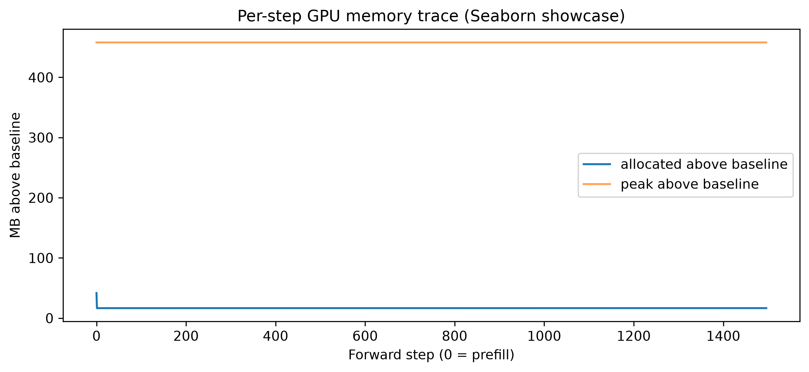
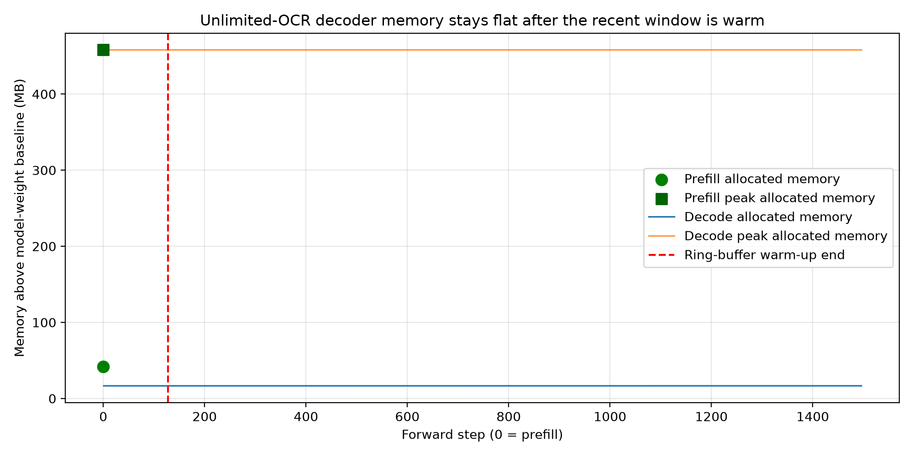
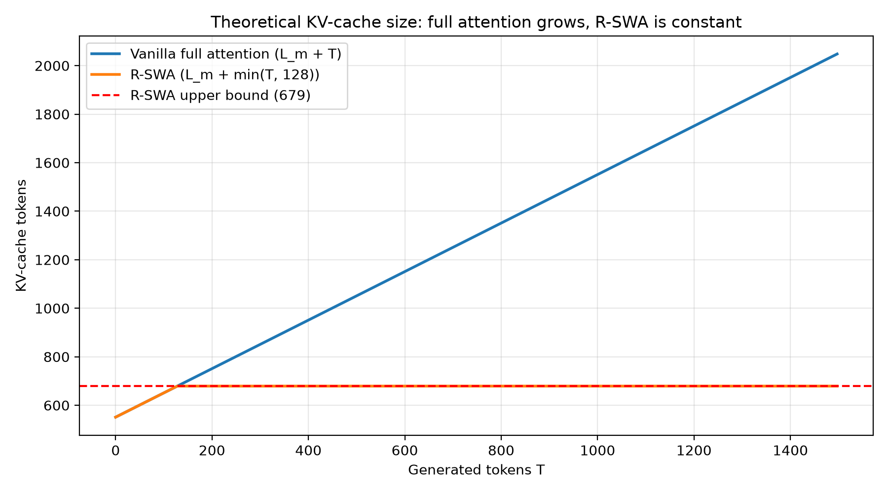
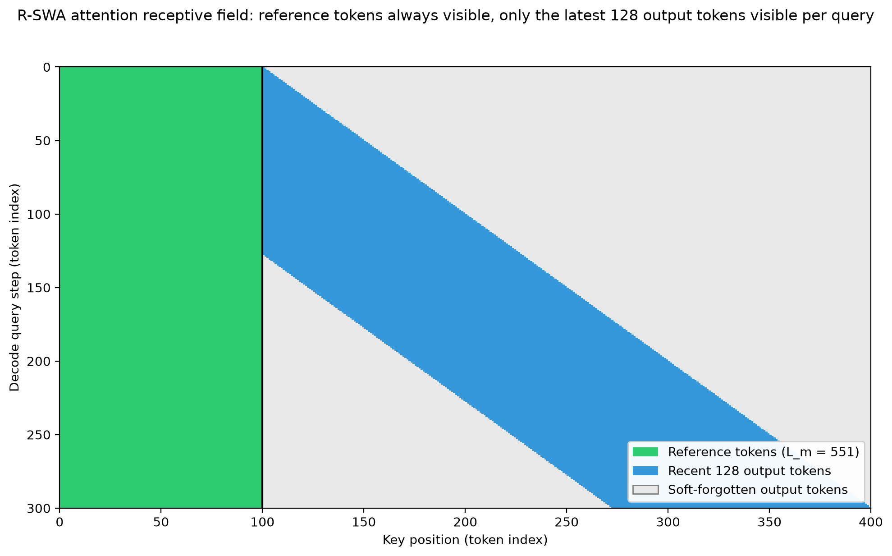

# 002 — R-SWA: decoder KV cache stays constant while output grows

- Notebook: [`notebooks/000-unlimited-ocr-demo/notebooks-py/002-attention-constant.py`](../notebooks/000-unlimited-ocr-demo/notebooks-py/002-attention-constant.py)
- Artifacts: [`outputs/2026-07-26/000-unlimited-ocr-demo/002-attention-constant/`](../outputs/2026-07-26/000-unlimited-ocr-demo/002-attention-constant/)
- Input: [`inputs/Unlimited-OCR.pdf`](../inputs/Unlimited-OCR.pdf), the paper being verified and used as its own test document

**Claim tested.** Unlimited-OCR's Reference Sliding Window Attention (R-SWA) bounds the decoder KV
cache at `L_m + n` tokens — reference prefix plus recent window — independent of how many tokens `T`
are generated. This experiment generated **1,497 tokens** over **2 paper pages** and measured GPU
memory at every decoder forward step. Result: allocated memory flat at **6,492.34–6,492.37 MB** from
the first decode step to the last; theoretical cache bound fixed at **679 tokens (39.79 MB)** the
whole time. The paper's Eq. (6) holds in the real model, on real hardware.

---

## 1. The paper claim

The Unlimited-OCR paper replaces every decoder attention layer of DeepSeek-OCR with R-SWA. Section
3.4.2 states the memory claim as two equations:

- **Full attention (baseline MHA):** `C_MHA(T) = L_m + T` — cache grows one slot per generated
  token, unbounded (Eq. 5).
- **R-SWA:** `C_R-SWA(T) = L_m + min(n, T) ≤ L_m + n` — cache is capped (Eq. 6).

Where:

- `L_m` = **reference tokens**: all visual tokens from the pages plus the text prompt. These are
  never evicted.
- `n` = **recent window**: only the last `n` generated tokens stay in the cache (default `n = 128`).
- `T` = total generated length, which grows without limit in long-horizon parsing.

The mechanism (paper Figure 1): each new token attends to **every reference token** and only the
**preceding `n` output tokens**. Older output tokens are "soft-forgotten" — dropped from the cache,
not compressed. Two properties follow:

1. **Constant cache.** Once `T > n`, the cache stops growing. The paper's cache ratio `ρ(T) = (L_m +
   n) / (L_m + T) → 0` as `T` grows (Eqs. 7–9).
2. **No visual blurring.** Unlike vanilla sliding-window attention, the reference (visual) tokens
   are excluded from eviction, so the model always sees the full-resolution page. Unlike linear
   attention, reference tokens undergo no recurrent state updates.

Why this matters for the product claim: the paper targets "dozens of pages in a single forward pass"
— 10K+ visual tokens decoding 100K+ text tokens. With full attention that decode is
memory-infeasible; with a cache of `L_m + n` it is not.

## 2. The experiment

The notebook turns the paper's algebra into a measurement:

1. **Feed the paper to itself.** Rasterize the first 2 pages of `inputs/Unlimited-OCR.pdf` at 300
   DPI, pad to 1024×1024 (Base mode), encode. Each page yields 273 visual tokens.
2. **Confirm R-SWA is actually active.** Inspect the loaded model's config and first decoder layer —
   no point profiling memory if the attention class is wrong.
3. **Compute the token budget.** Count reference tokens from the real `images_seq_mask`, read `n`
   from the model config, and compute the cache bound `L_m + n` and its size in MB from the model's
   layer/head geometry.
4. **Generate long.** Run greedy generation (`max_length=2048`) with a forward hook on the decoder
   recording `torch.cuda.memory_allocated()` and `max_memory_allocated()` after **every** forward
   pass — step 0 is the 551-token prefill, every later step is one decode token.
5. **Validate flatness numerically.** After the window is warm (step > 128), assert drift and std of
   allocated memory are near zero. A growing KV cache would show up as a steady upward slope.

Environment for this run: `baidu/Unlimited-OCR`, bf16, NVIDIA RTX 3090, eager attention.

## 3. Measured evidence

### 3.1 R-SWA is the attention actually running

From `run.log` (inspection of the loaded model):

```text
use_mla = False, attn_implementation = 'eager', sliding_window = 128,
num_hidden_layers = 12, num_attention_heads = 10, num_key_value_heads = 10,
hidden_size = 1280, attention_class = 'SlidingWindowLlamaAttention'
```

The decoder uses a dedicated `SlidingWindowLlamaAttention` class with `sliding_window = 128` — this
is the `n` from the paper, read from the model, not assumed.

### 3.2 Token budget: the predicted bound

[`01_token_budget.json`](../outputs/2026-07-26/000-unlimited-ocr-demo/002-attention-constant/intermediate/01_token_budget.json):

```json
{
  "visual_tokens": 546,
  "prompt_tokens": 5,
  "reference_tokens": 551,
  "recent_window": 128,
  "upper_bound_cache_tokens": 679,
  "upper_bound_cache_mb": 39.78515625
}
```

The arithmetic, end to end:

- 273 visual tokens per page × 2 pages = **546**; plus BOS + `"Multi page parsing."` = **5** prompt
  tokens → `L_m = 551`.
- `L_m + n = 551 + 128 = 679` cache tokens, forever.
- Bytes per cached token: `2 (K,V) × 12 layers × 10 KV heads × 128 head-dim × 2 B (bf16)` = 61,440 B
  → `679 × 61,440 B = 39.79 MB`.

Contrast at this run's actual length: full attention would hold `551 + 1497 = 2048` tokens ≈ **120
MB**; R-SWA held **39.8 MB** — a cache ratio `ρ ≈ 0.33`, and the ratio only improves as `T` grows.
That is Eq. (7) with real numbers.

### 3.3 Memory trace: flat after prefill

[`run_summary.json`](../outputs/2026-07-26/000-unlimited-ocr-demo/002-attention-constant/results/run_summary.json) anchors the run: `input_length=551`, `generated_length=1497`, `trace_steps=1497` (1 prefill + 1,496 decode forwards). First and last entries of the full trace are in [`decoder_memory_trace.json`](../outputs/2026-07-26/000-unlimited-ocr-demo/002-attention-constant/results/decoder_memory_trace.json), sampled in [`03_memory_trace_sample.json`](../outputs/2026-07-26/000-unlimited-ocr-demo/002-attention-constant/intermediate/03_memory_trace_sample.json):

| step | role | seq_len | allocated MB | peak MB |
|------|------|---------|--------------|---------|
| 0 | prefill (whole 551-token prefix) | 551 | 6517.48 | 6933.68 |
| 1 | decode token 1 | 1 | 6492.34 | 6933.68 |
| 2 | decode token 2 | 1 | 6492.34 | 6933.68 |
| 1494–1496 | decode tokens ~1,495–1,497 | 1 | 6492.37 | 6933.68 |

Numeric validation over the 1,368 steady-state steps (step > 128, from `run.log`):

```text
mean_allocated = 6492.36 MB   std = 0.009 MB   drift = +0.031 MB   passed = True
```

Total drift across ~1,370 generated tokens is **0.03 MB** — less than one KV-cache token (0.059 MB)
of growth, i.e. noise. Per-step view:



And the presentation plot with prefill separated from decode:



### 3.4 Theory vs measurement



The blue line is full attention: `551 + T`, growing linearly to 2,048 tokens at this run's length.
The orange line is R-SWA: `551 + min(T, 128)`, pinned at the red dashed bound of 679 after token
128. The measured trace in §3.3 is the memory-side shadow of the orange line.

### 3.5 Receptive field: what the mechanism looks like



Rows are decode steps, columns are key positions. Green (left block): the reference prefix — every
query, at every step, attends to all of it; this column block never shrinks. Blue (diagonal band):
each query sees only the most recent 128 generated tokens — the band slides right as decoding
advances and never widens. Gray: soft-forgotten output tokens — evicted, invisible. The visible-key
count per row is at most `L_m + n`; that *is* why the cache cannot grow. (Axes are display-clipped
to 100 reference / 300 generated tokens for readability. The full mask is in [`02_receptive_field_mask.npy`](../outputs/2026-07-26/000-unlimited-ocr-demo/002-attention-constant/intermediate/02_receptive_field_mask.npy), rendered again as [`02_receptive_field_mask_heatmap.png`](../outputs/2026-07-26/000-unlimited-ocr-demo/002-attention-constant/intermediate/02_receptive_field_mask_heatmap.png).

### 3.6 The generation that drove the trace

The output begins as structured table markup and later degenerates:

```text
<PAGE><|det|>table [0, 0, 999, 999]<|/det|><table><tr><td></td><td></td><td></td></tr><tr><td></td><td>1</td><td>2</td></tr>...
```

Full text: [`generated_text.txt`](../outputs/2026-07-26/000-unlimited-ocr-demo/002-attention-constant/results/generated_text.txt), 4,218 chars / 1,497 tokens. Snippet: [`04_generated_text_snippet.txt`](../outputs/2026-07-26/000-unlimited-ocr-demo/002-attention-constant/intermediate/04_generated_text_snippet.txt).
By the end the output is a loop of `.` / `)` / `(` fragments. For this experiment that is a feature,
not a bug: the run exists to force a long decode, and 1,497 tokens ≫ 128 means the window was
exercised ~11.7× past its capacity. OCR quality is not the claim being tested here; memory behavior is.

## 4. Interpretation

**Why step 0 is special.** Prefill runs one forward over all 551 reference tokens: it builds the
full prefix KV cache and pays transient costs (551² attention matrix, logits over all positions,
vision-encoder output staging). That sets the run's peak of 6,933.68 MB. After prefill those
transients are freed, so step-1 allocated (6,492.34) sits ~25 MB *below* step-0 allocated. Every
later step processes exactly one token (`seq_len=1`) against a fixed-size cache — same work, same
memory, every step.

**Allocated vs peak, and what each proves.**

- `allocated_mb` = memory actually held by live tensors at that instant. It is flat because the set
  of live tensors per decode step is constant: weights, one input token, fixed-shape cache,
  fixed-shape activations.
- `peak_mb` = high-water mark since reset. It never moves after step 0, meaning *no decode step ever
  asked for more memory than prefill did*. The worst moment of the entire 1,497-token generation was
  the very first forward pass. For long-horizon parsing this is the key operational fact: if prefill
  fits, the whole decode fits, however long it runs.

**Why flat even during "warm-up" (steps 1–128)?** The red dashed line at step 128 in the plot marks
when the *logical* window fills. The memory line is flat from step 1 because the implementation uses
a static cache: the 128-slot per-layer ring buffer is allocated at full size on the first decode
step, then overwritten in place. So `min(n, T)` in Eq. (6) is the logical content; the allocation
jumps straight to `n`. That means flat allocated memory should be read together with the token-budget math and the attention implementation, not alone.

**The scale check.** The entire R-SWA cache bound is 39.79 MB against ~6.5 GB of resident memory —
0.6%. R-SWA's win is not visible as a smaller footprint at these lengths; it is visible as the
*absence of growth*, and it becomes decisive only at the paper's operating point (100K+ output
tokens, where full attention would need ~6 GB of cache for this geometry and R-SWA still needs 39.79
MB).

## 5. What would falsify the claim / what to check next

Ordered by evidentiary strength:

1. **Instrument cache shapes directly (strongest).** Log `past_key_values` tensor shapes per layer
   at each step. R-SWA predicts the key/value length caps at `551 + min(T, 128)`. Any layer whose
   cache length exceeds 679 falsifies the bound outright — this is the direct measurement the memory
   trace only implies.
2. **Ablation: disable the sliding window.** Force full attention on the identical input and
   re-trace. Prediction: allocated memory grows ~0.059 MB/token (slope visible within a few hundred
   steps) and peak rises through the run. If memory stays flat even with the window disabled, the
   flat trace in this experiment was an artifact of preallocation, not of R-SWA.
3. **Attention-mass probe.** For a late decode step, verify attention weights on keys older than `T
   − 128` are exactly zero (not just small). "Soft-forgotten" should mean structurally absent.
4. **Scale `L_m`, not just `T`.** Run 10–30 pages. Prediction: the bound moves up with `L_m` (more
   visual tokens) but memory *still* goes flat after prefill, and prefill peak — not decode —
   remains the planning number.
5. **Push `T` toward 32K.** The paper's regime. Check the drift stays ~0 and quantify where output
   quality collapses relative to window size — sweep `n ∈ {64, 128, 256, 512}` and measure OCR
   accuracy per `n` to find the quality/memory knee the paper claims sits at 128.
6. **Kernel-level check.** Repeat with a fused attention kernel to test the paper's per-call latency
   claim (Figure 3), which this eager-mode run cannot see.

## Artifact map

| Artifact | What it evidences |
|---|---|
| [`results/run_summary.json`](../outputs/2026-07-26/000-unlimited-ocr-demo/002-attention-constant/results/run_summary.json) | Run anchors: `L_m=551`, `n=128`, bound 679, `T=1497` |
| [`intermediate/01_token_budget.json`](../outputs/2026-07-26/000-unlimited-ocr-demo/002-attention-constant/intermediate/01_token_budget.json) | Eq. (6) bound and 39.79 MB from model geometry |
| [`results/decoder_memory_trace.json`](../outputs/2026-07-26/000-unlimited-ocr-demo/002-attention-constant/results/decoder_memory_trace.json) | Full 1,497-step allocated/peak trace |
| [`intermediate/03_memory_trace_sample.json`](../outputs/2026-07-26/000-unlimited-ocr-demo/002-attention-constant/intermediate/03_memory_trace_sample.json) | First/last steps of the trace |
| [`plots/decoder_memory_allocated_peak.png`](../outputs/2026-07-26/000-unlimited-ocr-demo/002-attention-constant/plots/decoder_memory_allocated_peak.png) | Flat decode memory; prefill sets lifetime peak |
| [`plots/kv_cache_theory.png`](../outputs/2026-07-26/000-unlimited-ocr-demo/002-attention-constant/plots/kv_cache_theory.png) | `L_m + T` vs `L_m + min(n, T)` growth curves |
| [`plots/attention_receptive_field.png`](../outputs/2026-07-26/000-unlimited-ocr-demo/002-attention-constant/plots/attention_receptive_field.png) | R-SWA mask: fixed reference block + sliding 128-wide band |
| [`intermediate/02_receptive_field_mask.npy`](../outputs/2026-07-26/000-unlimited-ocr-demo/002-attention-constant/intermediate/02_receptive_field_mask.npy) / [`..._heatmap.png`](../outputs/2026-07-26/000-unlimited-ocr-demo/002-attention-constant/intermediate/02_receptive_field_mask_heatmap.png) | Raw mask data + heatmap render |
| [`results/generated_text.txt`](../outputs/2026-07-26/000-unlimited-ocr-demo/002-attention-constant/results/generated_text.txt) | The 1,497-token output that stressed the window ~11.7× |
| [`inputs/pages/page_0001.png`](../outputs/2026-07-26/000-unlimited-ocr-demo/002-attention-constant/inputs/pages/page_0001.png), [`page_0002.png`](../outputs/2026-07-26/000-unlimited-ocr-demo/002-attention-constant/inputs/pages/page_0002.png) | Rasterized paper pages used as input |
| [`run.log`](../outputs/2026-07-26/000-unlimited-ocr-demo/002-attention-constant/run.log) | Attention-class inspection, steady-state validation stats |
