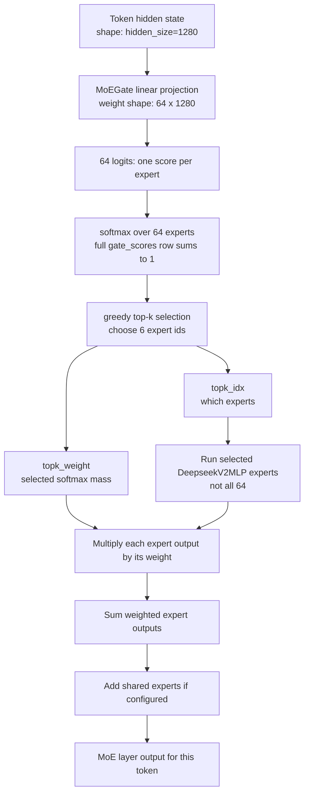
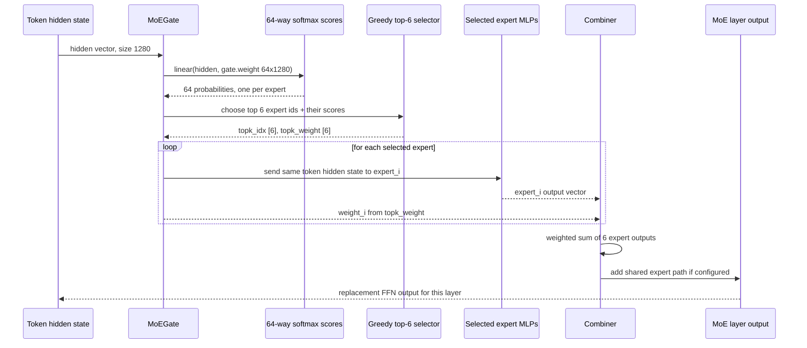

# Mixture of Experts Refresher — for Unlimited-OCR / DeepSeek-style MoE

This is not a research report. This is a mental model for reading `docs/reports/001-moe-inspection.md` without getting lost.

## Quick visual map

These diagrams use the exact Unlimited-OCR architecture facts from the notebook/run log.

Big picture first: **there is not one MoE router in the whole model. There are 11 MoE layers.**
Each token is routed again at each MoE layer, so the same token can choose different experts as it
moves upward through the decoder.

```text
TRANSFORMER DECODER = stack of layers

input tokens
   |
   v
+---------+
| layer 0 |  attention + normal dense FFN
+---------+
   |
   v
+---------+
| layer 1 |  attention + MoE FFN  <-- first MoE router inspected in detail
+---------+
   |
   v
+---------+
| layer 2 |  attention + MoE FFN  <-- token is routed again here
+---------+
   |
   v
   ...
   |
   v
+----------+
| layer 11 | attention + MoE FFN  <-- routed again here too
+----------+
   |
   v
output logits / next token
```

Inside each MoE FFN block:

```text
token vector
   |
   v
+------+
| gate |  scores 64 routed experts
+------+
   |
   v
pick top 6 experts
   |
   +-------> Expert A ---- output * weight_A ----+
   |                                             |
   +-------> Expert B ---- output * weight_B ----+
   |                                             |
   +-------> Expert C ---- output * weight_C ----+--> sum --> routed output
   |                                             |
   +-------> Expert D ---- output * weight_D ----+
   |                                             |
   +-------> Expert E ---- output * weight_E ----+
   |                                             |
   +-------> Expert F ---- output * weight_F ----+

shared expert path ------------------------------------------+
                                                             |
routed output -----------------------------------------------+--> final MoE FFN output
```

Read this as: layer 1 routing is only first MoE decision. Layer 2, 3, …, 11 do their own routing
again from the token representation they receive.

## MoE refresher, question-answer style

**Q: Is this router like LiteLLM routing a request to one model?**  
No. LiteLLM routes one whole request to one model endpoint. MoE routes one token, inside one layer,
to a few small FFN subnetworks.

**Analogy:** LiteLLM router = choose one restaurant for dinner. MoE router = one kitchen station
chooses six cooks to work on one ingredient, blends their work, then sends it to the next station.

**Q: Where does DeepSeek fit?**  
Unlimited-OCR inherits a DeepSeek-style MoE decoder. DeepSeek-V2 reports 160 routed experts + 2
shared experts, with 6 routed experts active per token. This Unlimited-OCR checkpoint is smaller:
actual loaded config/run.log show 64 routed experts, top-6 per token, plus 2 shared experts.

**Q: What is an “expert”?**  
An expert is a `DeepseekV2MLP` feed-forward block. It is not a full LLM. It is not an API endpoint.
It is one FFN subnetwork inside a transformer layer.

**Q: What does the gate look like?**  
In code, `MoEGate.weight` has shape `[64, 1280]`. For each token hidden vector of size 1280, the
gate computes 64 scores — one score per routed expert.

**Q: Why softmax over 64?**  
Because the gate is asking: “for this token at this layer, how much does each of the 64 experts
seem useful?” The full 64-way softmax is `gate_scores`.

**Q: Does it choose one expert?**  
No. It selects top-6 experts. Then it runs all 6 selected expert MLPs and computes a weighted sum of
their outputs.

**Q: What is the formula saying?**  
For one token, the MoE FFN output is:

$$
\text{output} = \text{shared expert output} + \text{weighted mix of selected routed expert outputs}
$$

More explicitly:

$$
\text{output} = \text{shared}(\text{token}) + \sum_{i \in \text{top-6 experts}} \text{weight}_i \cdot \text{expert}_i(\text{token})
$$

Term translation:

- `token`: current token representation entering this MoE layer.
- `expert_i(token)`: output of expert `i` after processing that token.
- `weight_i`: router weight for expert `i`.
- `top-6 experts`: only these six routed experts run.
- `shared(token)`: always-on shared expert path, added for every token.

So the model does not pick one expert. It makes a weighted blend of six routed expert outputs, plus the shared path.

**Q: What should I remember before reading plots?**  
Evidence 3 shows the full 64-way softmax. Evidence 4 throws away weights and only shows “was this
expert selected at least once?” Evidence 2 keeps both expert ids and weights.

Actual code path in Unlimited-OCR's cached `modeling_deepseekv2.py`:



Read that flowchart left to right as data transformation. The token is not leaving the model; it is
being transformed by several FFN subnetworks inside the current transformer layer.

---

Same thing as a sequence for **one token in one MoE layer**:

Algorithm in plain English:

1. **Score experts**
   - Token vector enters the MoE layer.
   - Gate scores all 64 routed experts.
   - Softmax turns raw scores into gate scores.

2. **Select experts**
   - Gate picks top 6 experts.
   - Other 58 routed experts are ignored for this token in this layer.

3. **Run selected experts**
   - Same token vector is sent to those 6 experts.
   - Each selected expert returns an output vector.

4. **Blend outputs**
   - Each expert output is multiplied by its gate weight.
   - Weighted expert outputs are summed.

5. **Finish layer FFN output**
   - Shared expert path is added.
   - Final MoE output goes to the next transformer layer.

Tiny concrete example from layer 1:

```text
token = "Ġquick"

selected experts:
E17 = 0.8965
E46 = 0.0192
E59 = 0.0145
E44 = 0.0108
E22 = 0.0061
E34 = 0.0061

final = shared("Ġquick")
      + 0.8965 * E17("Ġquick")
      + 0.0192 * E46("Ġquick")
      + 0.0145 * E59("Ġquick")
      + 0.0108 * E44("Ġquick")
      + 0.0061 * E22("Ġquick")
      + 0.0061 * E34("Ġquick")
```

Core idea: dense FFN uses the same FFN for every token; MoE FFN builds a custom weighted blend of a few experts for each token.



Example row, layer 1:

```text
Ġquick -> experts [17, 22, 44, 46, 59, 34]
weights [0.8965, 0.0061, 0.0108, 0.0192, 0.0145, 0.0061]
```

Read it as: run those six experts on `Ġquick`, multiply each output by its weight, then sum. Expert
17 dominates, but the model still selected six experts.

## 1. What problem is MoE solving?

Normal transformer layer:

```text
token
  |
  v
attention
  |
  v
same FFN for every token
  |
  v
next layer
```

MoE transformer layer:

```text
token
  |
  v
attention
  |
  v
gate chooses a few FFN experts
  |
  v
weighted mix of expert outputs
  |
  v
next layer
```

Core idea:

```text
Dense FFN: every token uses same FFN weights.
MoE FFN: each token gets a custom blend of a few expert FFNs.
```

So MoE is mainly about the **FFN part**, not the attention part.

## 2. What is a layer?

A layer is one processing block in the transformer stack.

Unlimited-OCR decoder has 12 layers:

```text
input tokens
   |
   v
+---------+
| layer 0 |  attention + normal dense FFN
+---------+
   |
   v
+---------+
| layer 1 |  attention + MoE FFN
+---------+
   |
   v
+---------+
| layer 2 |  attention + MoE FFN
+---------+
   |
   v
   ...
   |
   v
+----------+
| layer 11 | attention + MoE FFN
+----------+
   |
   v
output logits / next token
```

Important point:

```text
There is not one MoE router in the whole model.
There are 11 MoE layers.
A token is routed again at every MoE layer.
```

So token `Ġquick` can pick experts in layer 1, then different experts in layer 2, then different experts again in layer 3.

## 3. Is the MoE router like LiteLLM routing?

No.

LiteLLM router:

```text
whole user request -> choose one model endpoint
```

MoE router:

```text
one token inside one layer -> choose 6 small FFN experts
```

Analogy:

```text
LiteLLM router = choose one restaurant for dinner.
MoE router = kitchen station chooses six cooks for one ingredient, blends their work, then passes dish to next station.
```

## 4. What is an FFN expert?

FFN = feed-forward network.

In a transformer layer, after attention, each token goes through an FFN/MLP block.

Simple FFN mental model:

```text
token vector
   |
linear up
   |
activation
   |
linear down
   |
updated token vector
```

In Unlimited-OCR code, each routed expert is `DeepseekV2MLP`:

```python
down_proj(act_fn(gate_proj(x)) * up_proj(x))
```

Meaning:

```text
token vector x
   |
   +--> gate_proj(x) --> activation ----+
   |                                    * --> down_proj --> expert output
   +--> up_proj(x) ---------------------+
```

So expert is not:

```text
another LLM
another endpoint
another attention module
```

Expert is:

```text
one FFN/MLP subnetwork with its own weights
```

## 5. What does the gate do?

For one token in one MoE layer:

```text
token vector size = 1280
64 routed experts exist
gate scores all 64 experts
softmax makes 64 gate scores
top 6 experts are selected
```

Actual code facts:

```text
MoEGate.weight shape = [64, 1280]
```

That means:

```text
64 expert score vectors
one score vector per expert
compare token vector against all 64
```

## 6. What is a gate score?

Gate score = router preference for one expert on one token at one layer.

Not “probability this expert is correct.”  
More like “how much should this expert contribute to this token update?”

For token `Ġquick`, layer 1:

```text
E17 = 0.8965
E46 = 0.0192
E59 = 0.0145
E44 = 0.0108
E22 = 0.0061
E34 = 0.0061
```

Meaning:

```text
Layer 1 gate thinks expert 17 should do most of the FFN work for token Ġquick.
Other selected experts add small support.
```

## 7. Does MoE choose one expert?

No.

For each token in each MoE layer:

```text
select top 6 routed experts
run all 6
multiply each expert output by gate weight
sum them
add shared expert path
```

So it is not:

```text
token -> one expert
```

It is:

```text
token -> six experts -> weighted blend
```

## 8. One-token MoE algorithm

For one token in one MoE layer:

1. **Score experts**
   - Token vector enters MoE layer.
   - Gate scores all 64 routed experts.
   - Softmax turns raw scores into gate scores.

2. **Select experts**
   - Gate picks top 6 experts.
   - Other 58 routed experts are ignored for this token in this layer.

3. **Run selected experts**
   - Same token vector goes into those 6 experts.
   - Each selected expert returns output vector.

4. **Blend outputs**
   - Each expert output is multiplied by its gate weight.
   - Weighted expert outputs are summed.

5. **Finish FFN output**
   - Shared expert path is added.
   - Final MoE output goes to next transformer layer.

Diagram:

```text
token vector
   |
   v
+------+
| gate |  scores 64 routed experts
+------+
   |
   v
pick top 6 experts
   |
   +-------> Expert 17 ---- output * 0.8965 ----+
   |                                             |
   +-------> Expert 46 ---- output * 0.0192 ----+
   |                                             |
   +-------> Expert 59 ---- output * 0.0145 ----+--> sum --> routed output
   |                                             |
   +-------> Expert 44 ---- output * 0.0108 ----+
   |                                             |
   +-------> Expert 22 ---- output * 0.0061 ----+
   |                                             |
   +-------> Expert 34 ---- output * 0.0061 ----+

shared expert path ------------------------------------------+
                                                             |
routed output -----------------------------------------------+--> final MoE FFN output
```

## 9. Where attention fits

Your understanding of attention can stay intact.

Layer flow:

```text
input hidden state
   |
   v
attention over tokens
   |
   v
residual add
   |
   v
MoE FFN per token
   |
   v
residual add
   |
   v
next layer
```

Attention answers:

```text
Which other tokens should this token look at?
```

MoE answers:

```text
Which FFN experts should process this token after attention?
```

So:

```text
attention = token-to-token mixing
MoE = expert-FFN selection per token
```

## 10. Does this happen during inference?

Yes.

Training:

```text
gate learns routing
training may use auxiliary losses for balance
```

Inference:

```text
gate still routes each token
top-6 experts still run
outputs are still blended
no training loss is computed
```

`001-moe-inspection` is observing inference-time routing.

## 11. Does it happen in parallel or sequence?

Across layers:

```text
sequential
layer 1 -> layer 2 -> layer 3 -> ... -> layer 11
```

Inside one MoE layer:

```text
gate first
selected experts independent after gate
outputs blended after experts finish
```

Actual Hugging Face-style source groups tokens per expert and loops expert-by-expert, but expert computations are independent and inference engines can optimize/parallelize them.

## 12. Why Evidence 3 and Evidence 4 look different

Evidence 3: gate scores

```text
full 64-way softmax
keeps weights
row sums to 1
```

Evidence 4: top-k selections

```text
binary yes/no matrix
1 = token selected this expert at least once across MoE layers
weights are discarded
```

So:

```text
Evidence 3 = how strongly layer 1 gate likes each expert
Evidence 4 = which experts got selected across all MoE layers
```

## 13. What should you remember?

Shortest version:

```text
MoE is a sparse FFN replacement.
Each MoE layer has many expert FFNs.
For each token, gate scores experts.
Top 6 experts run.
Their outputs are weighted and summed.
This happens again at every MoE layer.
```

One-line mental model:

```text
MoE = per-token, per-layer, weighted committee of FFN specialists.
```
