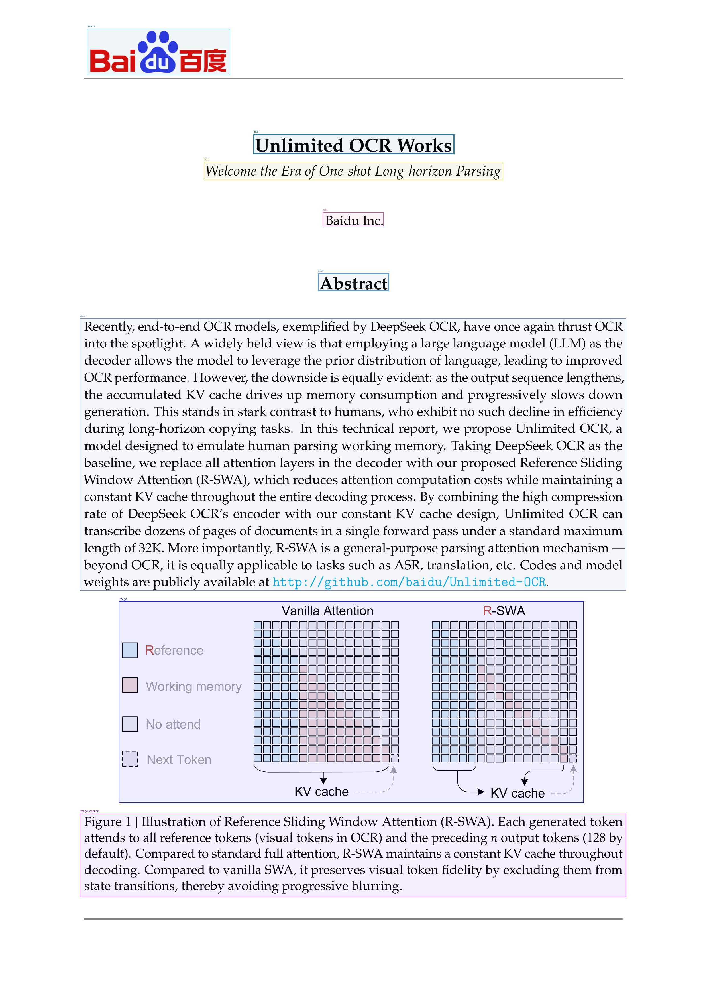

# 000 — What Unlimited-OCR actually reads from its own paper (BASE mode, page 1)

- Notebook: `notebooks/000-unlimited-ocr-demo/notebooks-py/000-run-unlimited-ocr.py`
- Output folder: `outputs/2026-07-26/000-unlimited-ocr-demo/000-run-unlimited-ocr/`

## The question

Unlimited-OCR claims one-shot document parsing: no separate layout-analysis stage, just a vision
encoder + LLM decoder emitting structured text. Before trusting that claim on hard documents, this
notebook asks a minimal, checkable question:

> **Given a single clean page (page 1 of the Unlimited-OCR paper itself), does the model
> recover not just the words, but the *structure* — which text is a header, a title, body
> text, a figure, a caption — in one decoding pass?**

The interesting part is not whether it can read (any modern OCR reads a clean page). It is whether
the raw output already carries layout semantics that downstream code can turn into a table, a boxed
image, and a markdown document without extra models.

## The experiment

One page, one mode, greedy decoding. The committed config runs `first_1_base`: page 1 of the paper
rasterized at 300 DPI, BASE mode (single square view, no cropping), `max_length=32768`,
`no_repeat_ngram_size=35`.

What the model actually saw, measured rather than assumed:

- Input page: 2481 × 3508 px PNG — [`00_input_page.png`](../../outputs/2026-07-26/000-unlimited-ocr-demo/000-run-unlimited-ocr/intermediate/00_input_page.png).
- BASE preprocessing letterboxes that onto a 1024 × 1024 gray canvas and normalizes to a `[3, 1024, 1024]` bfloat16 tensor in [-1, 1] — [`01_preprocessed_global_view.png`](../../outputs/2026-07-26/000-unlimited-ocr-demo/000-run-unlimited-ocr/intermediate/01_preprocessed_global_view.png).
- Tokenized prompt — [`02_tokenized_prompt.json`](../../outputs/2026-07-26/000-unlimited-ocr-demo/000-run-unlimited-ocr/intermediate/02_tokenized_prompt.json):

```json
{
  "formatted_prompt": "<image>document parsing.",
  "num_tokens": 277,
  "num_visual_tokens": 273,
  "num_text_tokens": 4,
  "num_queries_per_side": 16
}
```

The token budget is the first real finding: **273 of 277 input tokens are visual**, and 273 = 16² +
16 + 1 — the notebook replicates the model's own scheme of a 16 × 16 grid of visual queries plus
row/column separators. The entire "instruction" is 4 text tokens (`document parsing.`). So this
experiment tests image → structured-text behavior with almost zero linguistic steering. Whatever
structure appears in the output came from the image, not from a clever prompt.

## Evidence: the raw stream is the whole story

Everything downstream — the CSV, the boxed image, the final markdown — is a re-rendering of one decoded string: [`03_raw_generated_text.txt`](../../outputs/2026-07-26/000-unlimited-ocr-demo/000-run-unlimited-ocr/intermediate/03_raw_generated_text.txt).

Its spine:

```text
<|det|>header [123, 29, 325, 75]<|/det|>Baidu百度
<|det|>title [358, 134, 642, 154]<|/det|>Unlimited OCR Works
<|det|>text [288, 162, 711, 180]<|/det|>Welcome the Era of One-shot Long-horizon Parsing
<|det|>text [456, 212, 542, 226]<|/det|>Baidu Inc.
<|det|>title [449, 273, 550, 291]<|/det|>Abstract
<|det|>text [113, 318, 885, 590]<|/det|>Recently, end-to-end OCR models, exemplified by DeepSeek OCR, ...
<|det|>image [168, 601, 825, 802]<|/det|>
<|det|>image_caption [113, 813, 885, 896]<|/det|>Figure 1 | Illustration of Reference Sliding Window Attention (R-SWA). ...<｜end▁of▁sentence｜>
```

The format is `<|det|>LABEL [x1, y1, x2, y2]<|/det|>CONTENT`. Coordinates live on a normalized
~0–1000 grid (max coordinate seen: 896), not in pixels of the 2481 × 3508 page.

The pipeline from this one string to every other artifact:

1. **Regex parse → CSV.** `uocr.re_match` extracts each span; the notebook flattens it to one row per box in [`04_layout_predictions.csv`](../../outputs/2026-07-26/000-unlimited-ocr-demo/000-run-unlimited-ocr/intermediate/04_layout_predictions.csv) — 8 rows, columns `label, box, x1, y1, x2, y2`. Full table:

   | label | box |
   |---|---|
   | header | `[123, 29, 325, 75]` |
   | title | `[358, 134, 642, 154]` |
   | text | `[288, 162, 711, 180]` |
   | text | `[456, 212, 542, 226]` |
   | title | `[449, 273, 550, 291]` |
   | text | `[113, 318, 885, 590]` |
   | image | `[168, 601, 825, 802]` |
   | image_caption | `[113, 813, 885, 896]` |

Label counts, plotted in [`04_label_distribution.png`](../../outputs/2026-07-26/000-unlimited-ocr-demo/000-run-unlimited-ocr/intermediate/04_label_distribution.png): **text 3, title 2, header 1, image 1, image_caption 1.**

2. **Boxes → visualization.** The same matches are drawn back onto the original page by `uocr.process_image_with_refs`, producing [`05_result_with_boxes.jpg`](../../outputs/2026-07-26/000-unlimited-ocr-demo/000-run-unlimited-ocr/intermediate/05_result_with_boxes.jpg) and the equivalent `result_with_boxes.jpg` written by `model.infer` itself.

3. **Stream → final markdown.** `model.infer` strips the tags into [`result.md`](../../outputs/2026-07-26/000-unlimited-ocr-demo/000-run-unlimited-ocr/first_1_base/single_base/result.md). One special case: the `image` region has **empty content after its `<|/det|>` tag** — the model does not describe figures, it localizes them. The pipeline crops the box `[168, 601, 825, 802]` out of the page into `images/0.jpg` and substitutes a markdown embed, so the abstract paragraph is followed by a markdown image reference to `images/0.jpg` and then the caption text.

So: raw `<|det|>` stream is the single source of truth; CSV is its tabular view, the boxed JPEG its
spatial view, `result.md` its reading view. Debugging any of the three means reading the stream
first.

## Interpretation: what the model did well

- **Reading order and hierarchy are correct.** Header → title → subtitle → affiliation → "Abstract"
  → body → figure → caption matches the true page order, and the label assignment mostly matches
  human judgment (logo as `header`, paper title as `title`, subtitle as `text`).
- **The hard part — the abstract — is right.** The abstract is one dense ~150-word paragraph; the
  model grouped it as a single `text` block `[113, 318, 885, 590]` and the transcription is clean,
  including em-dashes, the acronym R-SWA, and the GitHub URL.
- **Figure vs. caption separation worked.** The figure was emitted as a pure localization (empty
  `image` content) while its caption was transcribed verbatim as a distinct `image_caption` region —
  exactly the behavior a downstream document store wants: crop the pixels, keep the caption as
  searchable text.
- **Structure genuinely comes from the image.** With only 4 text tokens of prompt, the label
  vocabulary (`header/title/text/image/image_caption`) and the box coordinates are the model's own
  reading of the page, not prompt parroting.

## What to inspect visually (don't trust the counts alone)

Open the boxed overlay and check these specific things:



- **Box tightness on Figure 1** (`image [168, 601, 825, 802]`): does the box hug the diagram, or
  bleed into the caption/abstract? Slop here pollutes the cropped `images/0.jpg`.
- **The "Abstract" heading is labeled `title`** (`[449, 273, 550, 291]`). Arguably it is a section
  heading, not a title — a sign the label taxonomy is coarse. On papers with real numbered section
  headings, watch whether they get `title`, `text`, or something else.
- **Header box** `[123, 29, 325, 75]` contains "Baidu百度" — mixed Latin + CJK glyphs read correctly
  inside a logo-style lockup, a harder case than body text.
- **Coordinate mapping**: boxes are on a 0–1000 normalized grid and are rescaled onto the 2481 ×
  3508 page for drawing. If a box ever looks systematically offset, suspect this rescaling step, not
  the model.
- **Stray token in the stream**: the caption line ends with a literal `<｜end▁of▁sentence｜>` inside
  the decoded text. Harmless here (stripped downstream), but worth remembering when parsing raw
  output with anything other than the reference regex.

## Artifact guide (what each file teaches)

| Artifact | Learning value |
|---|---|
| [`first_1_base/single_base/result.md`](../../outputs/2026-07-26/000-unlimited-ocr-demo/000-run-unlimited-ocr/first_1_base/single_base/result.md) | The end product. Note the markdown image substitution pointing to `images/0.jpg` — figures become crops, not text. |
| [`first_1_base/single_base/result_with_boxes.jpg`](../../outputs/2026-07-26/000-unlimited-ocr-demo/000-run-unlimited-ocr/first_1_base/single_base/result_with_boxes.jpg) | Grounding quality at a glance; check figure-box tightness and the "Abstract" label. |
| [`intermediate/00_input_page.png`](../../outputs/2026-07-26/000-unlimited-ocr-demo/000-run-unlimited-ocr/intermediate/00_input_page.png) | What 300 DPI born-digital input looks like before any squeezing. |
| [`intermediate/01_preprocessed_global_view.png`](../../outputs/2026-07-26/000-unlimited-ocr-demo/000-run-unlimited-ocr/intermediate/01_preprocessed_global_view.png) | The letterbox reality of BASE mode — compare with the input to feel the resolution loss. |
| [`intermediate/02_tokenized_prompt.json`](../../outputs/2026-07-26/000-unlimited-ocr-demo/000-run-unlimited-ocr/intermediate/02_tokenized_prompt.json) | Proof the run is 273/277 visual tokens; where the 16×16 query grid shows up concretely. |
| [`intermediate/02_formatted_prompt.txt`](../../outputs/2026-07-26/000-unlimited-ocr-demo/000-run-unlimited-ocr/intermediate/02_formatted_prompt.txt) | The full "instruction": `<image>document parsing.` — 24 bytes. |
| [`intermediate/03_raw_generated_text.txt`](../../outputs/2026-07-26/000-unlimited-ocr-demo/000-run-unlimited-ocr/intermediate/03_raw_generated_text.txt) | The single source of truth: label + box + content stream. Read this first when anything downstream looks wrong. |
| [`intermediate/04_layout_predictions.csv`](../../outputs/2026-07-26/000-unlimited-ocr-demo/000-run-unlimited-ocr/intermediate/04_layout_predictions.csv) | The stream as data: 8 rows × (label, box, x1–y2). The join point for any quantitative follow-up. |
| [`intermediate/04_label_distribution.png`](../../outputs/2026-07-26/000-unlimited-ocr-demo/000-run-unlimited-ocr/intermediate/04_label_distribution.png) | Label histogram; on multi-page runs this is where class imbalance would surface. |
| [`intermediate/05_result_with_boxes.jpg`](../../outputs/2026-07-26/000-unlimited-ocr-demo/000-run-unlimited-ocr/intermediate/05_result_with_boxes.jpg) | Notebook-rebuilt boxed view; matching `result_with_boxes.jpg` confirms the replication of the pipeline is faithful. |
| [`run.log`](../../outputs/2026-07-26/000-unlimited-ocr-demo/000-run-unlimited-ocr/run.log) | Execution trace: RTX 3090, bfloat16, artifact sizes; where to look when an artifact is missing or empty. |
