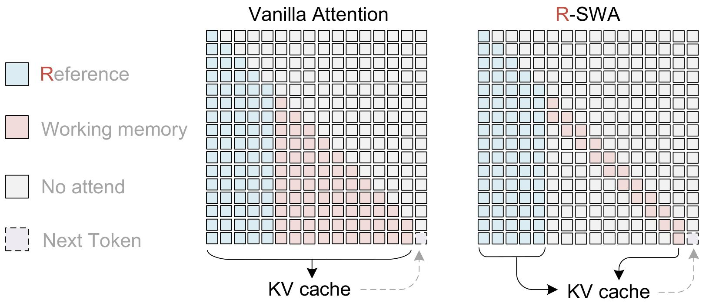

Baidu百度
Unlimited OCR Works
Welcome the Era of One-shot Long-horizon Parsing
Baidu Inc.
Abstract
Recently, end-to-end OCR models, exemplified by DeepSeek OCR, have once again thrust OCR into the spotlight. A widely held view is that employing a large language model (LLM) as the decoder allows the model to leverage the prior distribution of language, leading to improved OCR performance. However, the downside is equally evident: as the output sequence lengthens, the accumulated KV cache drives up memory consumption and progressively slows down generation. This stands in stark contrast to humans, who exhibit no such decline in efficiency during long-horizon copying tasks. In this technical report, we propose Unlimited OCR, a model designed to emulate human parsing working memory. Taking DeepSeek OCR as the baseline, we replace all attention layers in the decoder with our proposed Reference Sliding Window Attention (R-SWA), which reduces attention computation costs while maintaining a constant KV cache throughout the entire decoding process. By combining the high compression rate of DeepSeek OCR's encoder with our constant KV cache design, Unlimited OCR can transcribe dozens of pages of documents in a single forward pass under a standard maximum length of 32K. More importantly, R-SWA is a general-purpose parsing attention mechanism — beyond OCR, it is equally applicable to tasks such as ASR, translation, etc. Codes and model weights are publicly available at http://github.com/baidu/Unlimited-OCR.

Figure 1 | Illustration of Reference Sliding Window Attention (R-SWA). Each generated token attends to all reference tokens (visual tokens in OCR) and the preceding n output tokens (128 by default). Compared to standard full attention, R-SWA maintains a constant KV cache throughout decoding. Compared to vanilla SWA, it preserves visual token fidelity by excluding them from state transitions, thereby avoiding progressive blurring.